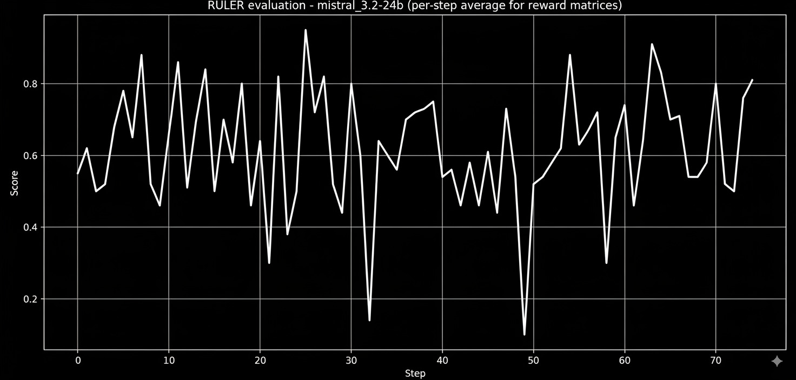
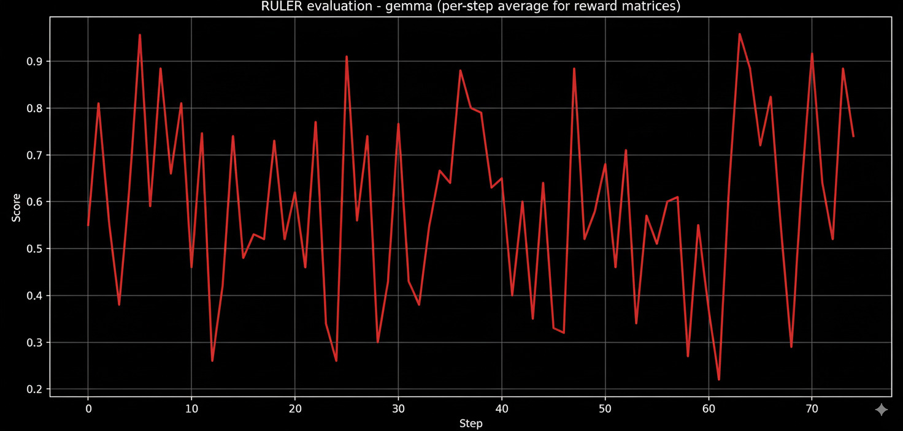
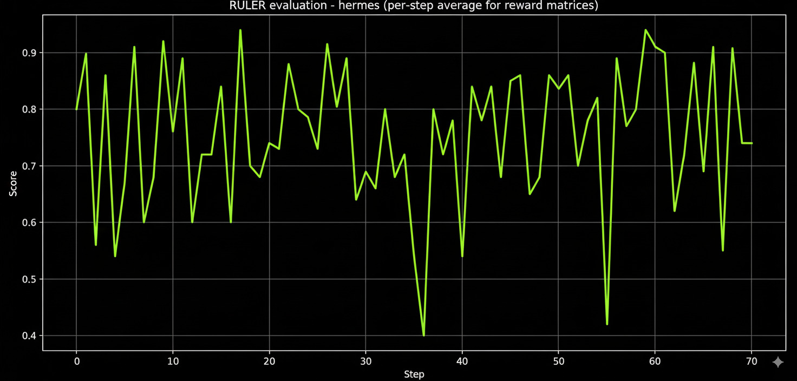
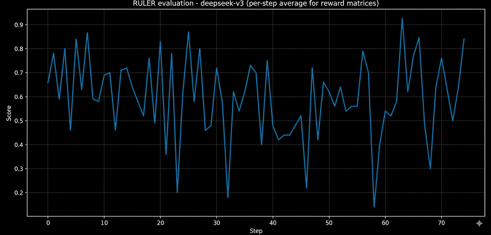
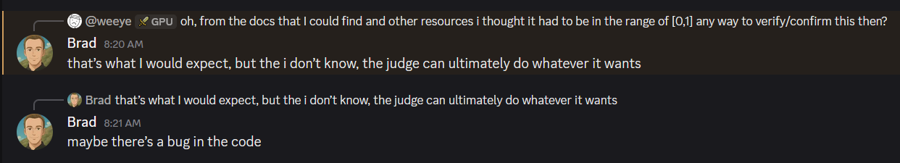
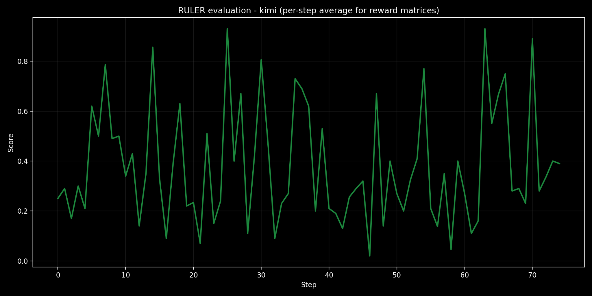
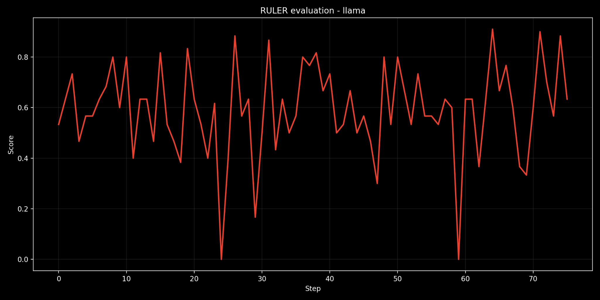

> From "never wasting a motivated moment" : recently I read about the concept in a blog by [@arb](https://twitter.com/arb8020) on twt [[link](https://arb8020.github.io/posts/motivated-moment/)] and it made me wonder if a similar event led to me tinkering around and eventually writing this blog, even though at times it gets hard to consciously stick to the idea but recently I have tried to work on fixing this with keeping the side project pipeline as free as possible to at least work on something out of the current heap of ideas instead of doing nothing with them,hence expect more of these random experiments (and some serious ones too) in the near future, moving onto the thoughts/results from the experiments on autoRL.

## Setup

The purpose of this experiment is to use the agentic reinforcement training framework for evaluating how different judge models:

1. Score the generated code on different parameters (e.g., accuracy, security, completeness, complexity, among others)
2. The reasons for their strictness/leniency towards a specific model
3. Whether a bias exists in judging out the code that was generated by itself (could adopt a process of randomizing the outputs and then evaluating them)

Even though there were many multi-step setups on which this could have been tested out and would have been probably better than the current task of code generation, it just seemed as a fun thing to optimize and play around with than any other ones.

The temperature is set to 1 for all the runs to be equally creative while generating their outputs and having a sense of variation in all the responses, without getting too deterministic in its approaches and limiting our evaluation for the same.

Another point was about the choice of judges that was done with keeping the thought of including the SOTA and latest models from the big labs and some from the underdog ones while also not making me broke (in this case I was fortunate enough to have cool people come out [[goat](https://x.com/advith_krishnan), [goat](https://x.com/MajorTimbWlf21)] to give free credits) with all the token calls from openrouter, the final judges are:

- **Mistral 4.2-24b**  
- **Gemma 3-27b-it**  
- **Hermes 2-pro-llama-3-8b**  
- **Deepseek v3-0324**  
- **Kimi K-2**  
- **Llama 3.3-70b-instruct**  


Finally moving onto evaluating the performance, the benchmarking was something that seemed vague to figure out since there wasn't a direct method to do so, going from evaluating from the ruler scores for each epoch with a specific judge, finding its mean and comparing that to the base model with the same judge, to using the final weights of the trained model for manual A/B testing, or on any other open source platforms like deepeval, codejudge, to finally settling on the mean method (this could probably be optimized by building a framework of your own later on).

## A Bit More Background on AutoRL and ART Framework

AutoRL → RL without providing any labelled data for the GRPO to train on, instead evaluations are done by another LLM model, RULER generates its scores between 0 and 1, gives feedback and then the base model is trained again to improve its abilities.

For all of these tasks we use ART (Agentic Reinforcement Trainer) by OpenPipe as a helper for RLAIF, the main goal here is to not find "excellent" or "well made" labelled datasets on which we can perform RL but to give a solid and structured prompt for the judge model.

We start with the base model generating its set of training inputs, which are then saved for keeping every run fair and unbiased towards all the models (num_training_inputs=25), they are then divided into groups (num_inp_groups=2) ~ 12.5 groups, this helps in faster computation but also in giving some space/distinction between each problem to inherit some properties present. Now starting with group 1, the model generates 5 candidates each, which are then evaluated by the ruler and used to update the weights for the next epoch, even for a smaller training run of 10 epochs some of the models kind of learnt well to produce meaningful code in the end.

The task description that was generated by GPT-4o is:

```
You are a professional programmer that can write quality code in various languages. You will be provided with the users text that would be a request for a programming task in natural language, Your goal is to generate a code solution to the programming task given, the code response should be structured in the following XML style tags:

<request>: This tag should wrap the user's original natural language request.

<language>: This tag should specify the programming language used in the code solution (e.g., Python, JavaScript, Java).

<code>: This tag should wrap the generated code block. The code should be well-commented.

For example, if the user's text is "write a python function that calculates the factorial of a number", the output should be:

<request>write a python function that calculates the factorial of a number</request>
<language>Python</language>
<code>
def factorial(n):
   if n < 0:
       raise ValueError("Factorial is not defined for negative numbers.")
   elif n == 0 or n == 1:
       return 1
   else:
       result = 1
       for i in range(2, n + 1):
           result *= i
       return result
</code>
```

## Observations

Though condensing the results in a short format seems really unfair here but I will try to give a general outlook of how things turned out in the end, but just to give a brief idea of how the candidates were generated and the quality of code we will review a log file of a random trajectory with the Mistral 4.2-24b.

**GENERATED TASK:** Create a REST API endpoint in Node.js Express that handles user login with JWT token generation.

**Trajectory-1:** SCORE= 0.4 :  RULER explanation: This is a very basic implementation. It gets the job done by providing a login endpoint and generating a JWT, but it uses hardcoded credentials which is a major security flaw and lacks any password hashing. It fulfills the core request but very poorly.

```javascript
const express = require('express');
const jwt = require('jsonwebtoken');

const app = express();
const port = process.env.PORT || 3000;

app.use(express.json());

app.post('/login', (req, res) => {
  const { username, password } = req.body;

  // Simulate user authentication
  if (username === 'admin' && password === 'password') {
    // Generate JWT token
    const token = jwt.sign({ userId: '123456', username }, 'secretKey', { expiresIn: '1h' });

    // Return token to client
    res.json({ token });
  } else {
    res.status(401).json({ message: 'Invalid credentials' });
  }
});

app.listen(port, () => console.log(`Server running on port ${port}`));
```

**Trajectory 5:** SCORE= 1.0 : RULER explanation: This trajectory provides the most complete solution. It includes registration and login, bcrypt for password hashing and verification, and a middleware function to protect routes ensuring a higher level of security. It even includes authentication with JWTs, and has error handling. This trajectory is closest to a production ready pattern.

```javascript
const express = require('express');
const jwt = require('jsonwebtoken');
const bcrypt = require('bcrypt');

const app = express();
const PORT = process.env.PORT || 3000;

// User data (replace with actual data)
const users = [
  { id: 1, username: 'user1', password: 'password1' },
  { id: 2, username: 'user2', password: 'password2' }
];

// Check if the user is logged in
const isLoggedIn = (req, res, next) => {
  const token = req.headers['authorization'].split(' ')[1];

  if (!token) {
    return res.status(401).send({ error: 'Unauthorized' });
  }

  jwt.verify(token, process.env.SECRET_KEY, (err, decoded) => {
    if (err || decoded.id !== req.user.id) {
      return res.status(401).send({ error: 'Unauthorized' });
    }

    req.user = decoded;
    next();
  });
};

// Register a new user
app.post('/register', (req, res) => {
  const { username, password } = req.body;

  const user = {
    id: users.length + 1,
    username
  };

  bcrypt.hash(password, 10).then(hash => {
    user.password = hash;
    users.push(user);
    res.status(201).send({ message: 'User registered', user: user });
  }).catch(err => {
    res.status(400).send({ error: 'Registration failed' });
  });
});

// Login a user
app.post('/login', (req, res) => {
  const { username, password } = req.body;

  users.forEach(user => {
    if (user.username === username && bcrypt.compareSync(password, user.password)) {
      const token = jwt.sign({ id: user.id, username }, process.env.SECRET_KEY, { expiresIn: '1h' });

      res.status(200).send({ token });
    }
  });

  res.status(401).send({ error: 'Invalid credentials' });
});

// Example routes
app.get('/protected', isLoggedIn, (req, res) => {
  res.send('Welcome to the protected area');
});

app.listen(PORT, () => console.log(`Server running on port ${PORT}`));
```

Funnily enough, the ruler remarks this trajectory as closest to "a production-ready pattern" but forget about the different security issues that it has like going to the extent of adopting to store the password as a literal string, the generated code doesn't even execute with it having multiple bugs like not importing the middleware while using it, and leaving the SECRET_KEY variable undefined.

A naive explanation for this might be how the judge model keeps checking for improvements in using specific keywords, complexity of the code, and better feature additions from the initial trajectory, without a sense of whether the solution even executes first, maybe ordering the parameters while evaluation could help with this issue, or using a model with reasoning mode would capture these better.

## Results

Even though all the trajectories were supposed to be evaluated by the ruler but often in between the models generated some codes that were out of the structure of the JSON model for that specific judge to evaluate. Let's split the judges now in 3 categories on the basis of their performance.

### The Mediocre Models

#### Mistral 3.2-24b

Mistral performs fairly well with mean and median scores of 62.7 and 70, and is consistent with its score having relatively fewer spikes and deviations than the other models, leading to an assumption of it having a reliable learning signal.

  
*Mistral 3.2-24b evaluation results*

#### Gemma 3-27b-it

The mean score for Gemma came out to be 58.7 and median as 60, it had more erratic runs and often dipped quite highly with its evals, comparing the standard deviation of it (~0.308) with the Mistral one (~0.320) doesn't quite tell the whole story, until a simple data analysis prompt on any LLM shows you the IQR, surprisingly both have the same IQR of 0.50 but for Gemma (Q1=0.35, Q3=0.85) and for Mistral (Q1=0.40, 0.90) highlighting the upward shifted values/lesser drop in the scores.


*Gemma 3-27b-it evaluation results*

### The Better Models

#### Hermes 2-pro-llama-3-8b

This was surprisingly (or unsurprisingly for some of us) the best performer in the set, with a mean score of 75.4 and a median of 80.0, and above that, it had a standard deviation of ~0.209, making it the most consistent, also with it rarely dropping below 0.5 and an IQR of 0.250. Now like a normal human being who likes judging things by the "taste" of them over some statistical results, I used the final weights on newer problems that weren't baseline easy and it actually gave an executable and a pretty well-structured code, unlike the previous ones that had a pretty broken result.




*Hermes 2-pro-llama-3-8b evaluation results*

#### Deepseek v3-0324

One of the other models that I really like, at the time of writing this they have a newer extension v3.1 which has improved thinking capacities over its predecessors by a margin, expectedly so even v3 trailed Hermes with scores of 69.2 and 70 for mean and median, another really abnormal/unique thing that I saw after while surfing the CSV result was couple of trajectories had a score of 2.0, while the ruler is supposed to give scores between 0 and 1 the only plausible reason that I could speculate of was maybe the judge finding that particular trajectory exceptionally better than the other trajectories in the same group unless this was a bug or a messup on my part. (After clarification from the devs, it indeed seems like a bug)


*Deepseek v3-0324 evaluation results*  
 
*dms*

### The "Not" So Good Models

#### Kimi K-2

Before starting this experiment, I was explicitly excited to try out Kimi and Hermes expecting them to top out the list, however unlike Hermes, Kimi doesn't come out as a numerical winner with mean and median of 38.2 and 25 putting it around the bottom instead with severe deviations, the graph looks more like an ECG display of a person having a heart attack, it made me wonder whether this was due to how the architecture of Kimi makes it inherently as more of a stricter judge than others, with around 1T parameters (~32 billion active per inference) and a total 384 experts, over that it has a post-training RL layer to optimize the model for verifiable rewards rather than subjectivity and creativity which models like Hermes prioritize more. While this might be an efficient parameter for judging but I did not want to limit the benchmarking to just "correct" or "incorrect" solutions, though another version of this just for correctness would be a fun thing to try out in future.

  
*Kimi K-2 evaluation results*

#### Llama 3.3-70b-instruct

Another case of relatively weird/unexpected results, while Llama does not score on the higher end but it definitely looks like most consistent model among all until you see that the drops are severe with it even going twice to zero, the standard deviation of 0.224 is still in the better range and except for these instances, you can rarely see a lot of variance. The mean and median for it are 58 and 60.0 with it never giving a perfect score but always being around the range of 0.95-0.98 something that is quite unique and makes you like Meta more.

  
*Llama 3.3-70b-instruct evaluation results*

## The Bias Experiment

As mentioned earlier, the plan is to check whether a specific judge model is biased towards scoring a base model when we keep both of them the same or just vary different versions of the base.

Initially on keeping the base and judge model same (namely Qwen 2.5 1.5b instruct) there was marginal improvement in the scores from the initial scores of 61.4 and 68 for mean and median, to ~62 and 69 eventually, indicating at least not a surface level bias (this has to be further extended to other models but due to my other commitments I'm too lazy to go back and verify it), when switching the judge to a further newer model qwen/qwen3-32b, again not a significant improvement is seen but still the scores bumped up in the range of ~0.5-1 for both, while saying that there has been a definite improvement/degradation seems a bit too far fetched and again needs to be checked with other sample models also.

## Conclusions

This started out as a fun experiment to test out the OpenPipe ruler framework and AutoRL environment and in between turned serious for a while, where I had many ideas of doing this without ruler by adopting either making a whole environment from the ground up or using any other framework that provides better reasoning/thought communication for tackling the problem of ruler scores not achieving their real values due to the accumulation of either a lot of parameters to verify and thereby missing some or the other one or misalignment of the algorithm used with the outputs.

Another suggestion that I received was testing the judges with a specific number of shots per each judge, like chain of thought shot (have a strong intuition that this would help increasing the scores), example shots, safety shots among others so we don't have to consider each parameter together and make the process more clumsier, reducing biases/variances if any and provide more thinking space.

Thank you for reading this and for any feedback,  dm or mail me
